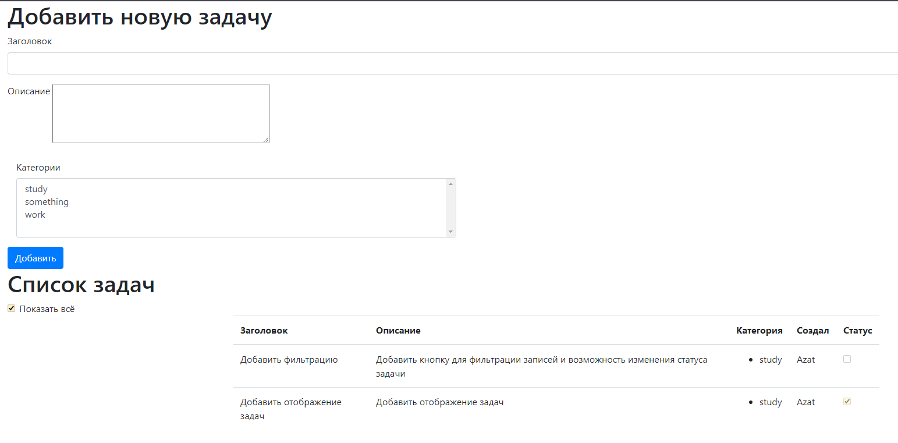
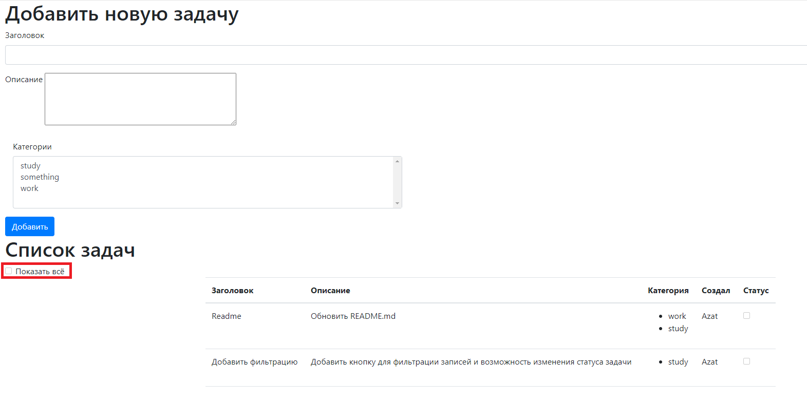

# Проект "TODO-list"

## Описание

MVC REST API - приложение, todo-список задач.\
Для хранения данных применяется Hibernate.\
Данные на главную страницу подгружаются через AJAX-запросы, которые возвращают данные в формате JSON.\

## Функционал
* Регистрация пользователя
* Аутентификация на сервлет-фильтрах
* Добавление задачи в TODO-list
* Изменение статуса задачи на выполненную
* Вывод всех задач
* Вывод только незавершённых задач

## Технологии
* Hibernate
* JDBC
* AJAX jquery
* Servlet & JSP
* HTML, CSS, BOOTSTRAP
* Apache Tomcat Server
* Junit, Mockito, Powermock
* Travis CI

## Интерфейс

Добавление новой задачи: при добавлении новой задачи необходимо указать заголовок, 
описание и выбрать одну или несколько категорий

После нажатия кнопки добавить созданная задача добавляется в список,
в котором также указывается, кто создал задачу

Был добавлен переключатель, позволяющий отобразить только незавершенные задачи

## Контакты

Идрисов Азат

Java-разработчик

a.idrisov23@yandex.ru