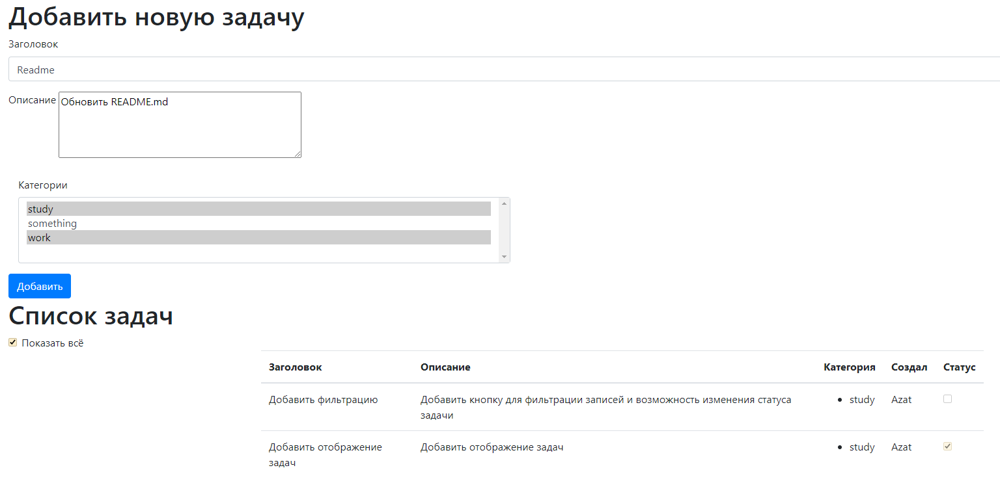
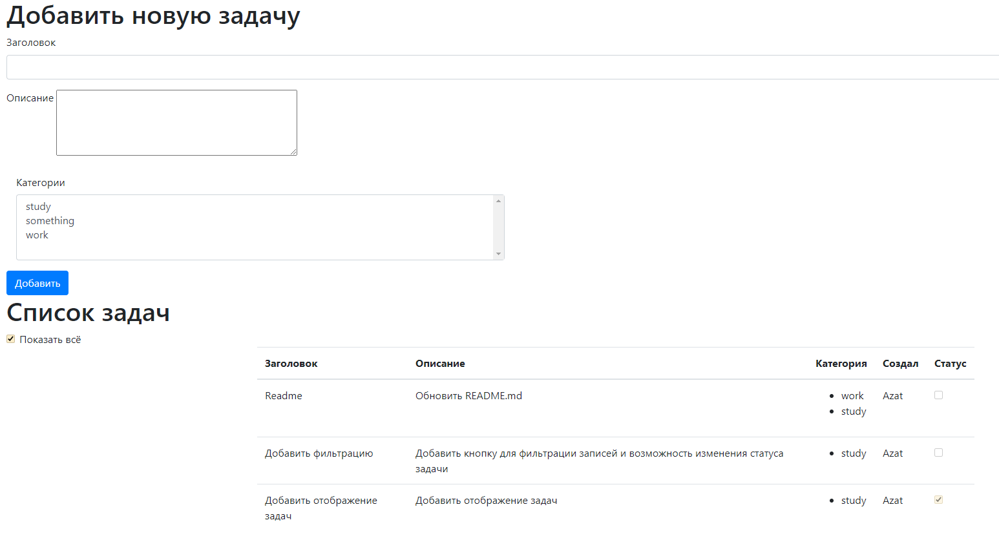

# job4j_todo_list

### Интерфейс

Добавление новой задачи: при добавлении новой задачи необходимо указать заголовок, 
описание и выбрать одну или несколько категорий

После нажатия кнопки добавить созданная задача добавляется в список,
в котором также указывается, кто создал задачу

Был добавлен переключатель, позволяющий отобразить только незавершенные задачи

